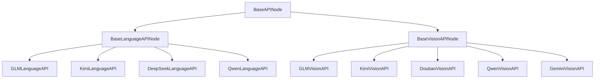

# 🎨QING API模块开发指南

> **📝 内部开发备忘录** - 用于API节点开发流程梳理和技术要点记录

## 📚 文档用途

**本文档是🎨QING项目内部开发备忘录**，为我们团队提供：

- 🔧 **标准化开发流程** - 统一的节点开发步骤和最佳实践
- 📝 **技术要点备忘** - 关键配置项和实现细节的快速查阅  
- 🎯 **架构设计参考** - 框架结构和组件关系的清晰梳理
- 🚀 **开发效率提升** - 减少重复性工作，确保开发质量一致性

## 📋 目录

- [快速开始](#快速开始)
- [添加新API节点](#添加新api节点)  
- [平台适配器开发](#平台适配器开发)
- [配置管理](#配置管理)
- [最佳实践](#最佳实践)
- [故障排除](#故障排除)

## 🚀 快速开始

### 模块概述

🎨QING API模块提供统一的AI模型API调用框架，基于面向对象设计，支持多平台、多模型的统一管理。

### 支持的平台

| 模型厂商 | 语言模型 | 视觉模型 | 支持平台 |
|---------|---------|---------|---------|
| 智谱AI | ✅ GLM | ✅ GLM-Vision | 智谱AI官方 |
| 月之暗面 | ✅ Kimi | ✅ Kimi-Vision | 月之暗面官方 |
| 通义千问 | ✅ Qwen | ✅ Qwen-Vision | 阿里云百炼、硅基流动 |
| DeepSeek | ✅ DeepSeek | ❌ | 火山引擎、硅基流动、DeepSeek官方 |
| 豆包 | ❌ | ✅ Doubao-Vision | 火山引擎 |
| Google | ❌ | ✅ Gemini-Vision | Google AI Studio |

### 架构设计

```
📁 nodes/api/
├── 📄 base_api_framework.py          # 核心框架
├── 📄 API_GLM_Language.py            # GLM语言模型
├── 📄 API_GLM_Vision.py              # GLM视觉模型
├── 📄 API_Kimi_Language.py           # Kimi语言模型
├── 📄 API_Kimi_Vision.py             # Kimi视觉模型
├── 📄 API_Qwen_Language.py           # Qwen语言模型
├── 📄 API_Qwen_Vision.py             # Qwen视觉模型
├── 📄 API_DeepSeek_Language.py       # DeepSeek语言模型
├── 📄 API_Doubao_Vision.py           # Doubao视觉模型
├── 📄 API_Gemini_Vision.py           # Gemini视觉模型
├── 📁 utils/                         # 工具模块
└── 📁 config/                        # 配置文件
```

### 继承体系



## ➕ 添加新API节点

**⚡ 开发备忘 - 严格按照以下6个步骤执行，缺一不可！**

### 步骤1：创建平台适配器

```python
# MyModel_Language_API.py
from typing import Dict, Any
from .base_api_framework import BasePlatformAdapter

class StandardMyModelAdapter(BasePlatformAdapter):
    """MyModel平台适配器"""
    
    def prepare_api_params(self, base_params: Dict[str, Any], **kwargs) -> Dict[str, Any]:
        """准备API调用参数"""
        params = base_params.copy()
        
        # 处理重复惩罚参数
        repetition_penalty = kwargs.get('repetition_penalty', 1.0)
        params = self.handle_repetition_penalty(params, repetition_penalty)
        
        # 应用token限制
        params["max_tokens"] = self.apply_token_limit(params["max_tokens"])
        
        return params
```

### 步骤2：创建API节点类

```python
class MyModelLanguageAPI(BaseLanguageAPINode):
    """MyModel语言模型API调用节点"""
    
    # 节点信息
    NODE_NAME = "MyModelLanguageAPI"
    DISPLAY_NAME = "MyModel_语言丨API"
    
    # 支持的模型列表
    MYMODEL_MODELS = [
        "mymodel-v1",
        "mymodel-v2-turbo",
        "mymodel-premium"
    ]
    
    # 平台配置
    PLATFORM_CONFIGS = {
        "MyModel平台": PlatformConfig(
            name="MyModel平台",
            base_url="https://api.mymodel.com/v1",
            api_key_env="MYMODEL_API_KEY",
            config_key="mymodel_api_key",
            platform_key="mymodel",
            models=MYMODEL_MODELS,
            model_mapping={model: model for model in MYMODEL_MODELS},
            supports_frequency_penalty=True
        ),
    }
    
    # 平台适配器映射
    PLATFORM_ADAPTERS = {
        "MyModel平台": StandardMyModelAdapter,
    }
    
    @classmethod
    def get_input_types(cls) -> Dict[str, Any]:
        """重写输入类型以添加特定的提示信息"""
        base_types = super().get_input_types()
        
        # 自定义提示信息
        base_types["required"]["text_input"][1]["tooltip"] = "输入要发送给MyModel的文本内容"
        base_types["required"]["model"][1]["tooltip"] = "选择要使用的MyModel模型"
        
        # 调整默认值
        base_types["optional"]["temperature"][1]["default"] = 0.7
        base_types["required"]["max_tokens"][1]["default"] = 4096
        
        return base_types
```

### 步骤3：添加配置文件支持

在 `config/config.json.example` 中添加新的API密钥配置：

```json
{
  "api_settings": {
    "mymodel_api_key": {
      "// ": "🤖 MyModel平台 (获取: https://platform.mymodel.com/api-keys)",
      "##在此填写MyModel API密钥##": "",
      "value": ""
    }
  }
}
```

### 步骤4：更新本地化文件

在 `locales/zh/main.json` 和 `locales/en/main.json` 中添加设置界面的翻译：

**中文版 (`locales/zh/main.json`)**:
```json
{
  "settings": {
    "🎨QING.API配置.MyModel_API_Key": {
      "name": "MyModel API Key",
      "tooltip": "MyModel平台的API密钥，用于模型调用。修改后会实时同步到本地配置文件。"
    }
  }
}
```

**英文版 (`locales/en/main.json`)**:
```json
{
  "settings": {
    "🎨QING.API配置.MyModel_API_Key": {
      "name": "MyModel API Key", 
      "tooltip": "API key for MyModel platform. Changes will be synced to local configuration file in real-time."
    }
  }
}
```

### 步骤5：注册设置项

在 `js/settings_sync.js` 中添加设置项注册：

```javascript
// 在settings数组中添加
{
    id: "🎨QING.API配置.MyModel_API_Key",
    name: "MyModel API Key",
    type: "text",
    defaultValue: "",
    tooltip: "MyModel平台的API密钥，用于模型调用。修改后会实时同步到本地配置文件。",
    attrs: {
        type: "password",
        placeholder: "请输入API Key..."
    },
    onChange: (newVal, oldVal) => {
        if (window.qingSettingsSync && !window.qingSettingsSync.isSyncing) {
            window.qingSettingsSync.syncToLocalConfig(newVal, "mymodel_api_key");
        }
    }
}

// 在getApiKeyMappings()方法中添加映射
{ settingId: "🎨QING.API配置.MyModel_API_Key", configKey: "mymodel_api_key" }
```

### 步骤6：注册节点

确保在主模块的 `NODE_CLASS_MAPPINGS` 中注册新节点。

### 🖼️ 视觉节点特殊配置

对于视觉模型节点，继承自 `BaseVisionAPINode`：

```python
class MyVisionAPI(BaseVisionAPINode):
    # 重写返回名称以适合视觉分析
    RETURN_NAMES = ("analysis_result", "conversation_info", "total_tokens")
    
    @classmethod
    def get_input_types(cls) -> Dict[str, Any]:
        base_types = super().get_input_types()
        
        # 视觉模型的默认参数
        base_types["optional"]["temperature"][1]["default"] = 0.3
        base_types["required"]["max_tokens"][1]["default"] = 2048
        
        return base_types
```

## 🔌 平台适配器开发

### 语言模型适配器

```python
class CustomLanguageAdapter(BasePlatformAdapter):
    """自定义语言模型平台适配器"""
    
    def prepare_api_params(self, base_params: Dict[str, Any], **kwargs) -> Dict[str, Any]:
        params = base_params.copy()
        
        # 1. 处理重复惩罚（语言模型专用）
        repetition_penalty = kwargs.get('repetition_penalty', 1.0)
        params = self.handle_repetition_penalty(params, repetition_penalty)
        
        # 2. 应用token限制
        params["max_tokens"] = self.apply_token_limit(params["max_tokens"])
        
        return params
```

### 视觉模型适配器

```python
class CustomVisionAdapter(BasePlatformAdapter):
    """自定义视觉模型平台适配器"""
    
    def prepare_api_params(self, base_params: Dict[str, Any], **kwargs) -> Dict[str, Any]:
        params = base_params.copy()
        
        # 1. 应用token限制
        params["max_tokens"] = self.apply_token_limit(params["max_tokens"])
        
        # 2. 处理图像质量（视觉模型专用）
        image_quality = kwargs.get('image_quality', 'auto')
        params = self.handle_image_quality(params, image_quality)
        
        return params
```

## ⚙️ 配置管理

### 配置文件结构

```json
{
  "api_settings": {
    "glm_api_key": {
      "// ": "🤖 智谱AI (获取: https://open.bigmodel.cn/usercenter/apikeys)",
      "##在此填写智谱AI密钥##": "",
      "value": ""
    },
    "volcengine_api_key": {
      "// ": "🌋 火山引擎 (获取: https://console.volcengine.com/ark)",
      "##在此填写火山引擎密钥##": "",
      "value": ""
    },
    "gemini_api_key": {
      "// ": "🔷 Google AI Studio (获取: https://aistudio.google.com/app/apikey)",
      "##在此填写Gemini API密钥##": "",
      "value": ""
    }
  },
  "sync_settings": {
    "auto_sync": true,
    "check_interval": 2000,
    "enable_logging": false
  },
  "version": "2.0.0"
}
```

### 配置管理API

```python
from .utils.settings_approach import get_config_manager

# 获取配置管理器
config_manager = get_config_manager()

# 获取API密钥
api_key = config_manager.get_api_key("platform_api_key")

# 更新API密钥
success = config_manager.update_api_key("new_key", "source", "platform_api_key")
```

### 环境变量优先级

API密钥获取优先级：
1. **环境变量** (最高优先级)
2. **配置文件** (中等优先级)  
3. **临时文件** (最低优先级)

## 🎯 最佳实践

**📋 内部开发规范备忘**

### 1. 代码规范

```python
# ✅ 推荐的代码风格
class MyAPINode(BaseLanguageAPINode):
    """
    清晰的类文档说明
    包含功能描述和使用方法
    """
    
    NODE_NAME = "MyAPINode"           # 使用清晰的节点名称
    DISPLAY_NAME = "My_API丨节点"      # 使用统一的显示格式
    
    # 使用类型注解
    def custom_method(self, param: str) -> Dict[str, Any]:
        """方法文档说明"""
        pass
```

### 2. 错误处理

```python
def safe_api_call(self):
    """安全的API调用示例"""
    try:
        response = self.make_api_call()
        return self._handle_success(response)
        
    except ImportError as e:
        return self._handle_dependency_error(e)
        
    except Exception as e:
        return self._handle_general_error(e)
```

### 3. 性能优化

- 使用类方法避免不必要的实例化
- 缓存重复计算结果
- 延迟加载大对象

## 🔧 故障排除

**🚨 常见问题速查备忘**

### 常见问题和解决方案

#### 1. API密钥问题

**问题**: "未提供API密钥"错误

**解决方案**:
1. 检查环境变量设置
2. 验证配置文件格式
3. 确认密钥有效性

#### 2. 模型不支持错误

**问题**: "模型兼容性错误"

**解决方案**:
1. 检查 `PLATFORM_CONFIGS` 中的模型列表
2. 验证 `model_mapping` 配置
3. 更新平台支持的模型

#### 3. 依赖导入错误

**问题**: 模块导入失败

**解决方案**:
1. 安装必要依赖: `pip install openai`
2. 检查虚拟环境配置
3. 验证Python路径

---

## 📝 更新日志

### v2.0.0 (当前版本)
- ✨ 重构为统一框架架构
- 🔧 添加平台适配器系统
- 🎯 支持10个API节点：
  - 语言模型：GLM、Kimi、Qwen、DeepSeek
  - 视觉模型：GLM-Vision、Kimi-Vision、Qwen-Vision、Doubao-Vision、Gemini-Vision
- 🏗️ 支持9个AI平台：智谱AI、月之暗面、阿里云百炼、硅基流动、火山引擎、DeepSeek官方、腾讯云、Google AI Studio

## 🚀 完整示例：Gemini_视觉丨API节点

以下是创建Gemini_视觉丨API节点的完整实现示例，展示了所有6个步骤：

### Python实现 (`API_Gemini_Vision.py`)
```python
from .base_api_framework import BaseVisionAPINode, BasePlatformAdapter, PlatformConfig

class GoogleAIStudioGeminiVisionAdapter(BasePlatformAdapter):
    def prepare_api_params(self, base_params, **kwargs):
        params = base_params.copy()
        params["max_tokens"] = self.apply_token_limit(params["max_tokens"])
        image_quality = kwargs.get('image_quality', 'auto')
        params = self.handle_image_quality(params, image_quality)
        return params

class GeminiVisionAPI(BaseVisionAPINode):
    NODE_NAME = "GeminiVisionAPI"
    DISPLAY_NAME = "Gemini_视觉丨API"
    RETURN_NAMES = ("analysis_result", "conversation_info", "total_tokens")
    
    PLATFORM_CONFIGS = {
        "Google AI Studio": PlatformConfig(
            name="Google AI Studio",
            base_url="https://generativelanguage.googleapis.com/v1beta/openai/",
            api_key_env="GEMINI_API_KEY",
            config_key="gemini_api_key",
            platform_key="google_ai_studio_vision",
            models=["gemini-2.5-flash-lite", "gemini-2.5-flash", "gemini-2.5-pro"],
            model_mapping={m: m for m in models}
        )
    }
    
    PLATFORM_ADAPTERS = {
        "Google AI Studio": GoogleAIStudioGeminiVisionAdapter
    }

NODE_CLASS_MAPPINGS = {"GeminiVisionAPI": GeminiVisionAPI}
NODE_DISPLAY_NAME_MAPPINGS = {"GeminiVisionAPI": "Gemini_视觉丨API"}
```

### 配置文件 (`config.json.example`)
```json
"gemini_api_key": {
  "// ": "🔷 Google AI Studio (获取: https://aistudio.google.com/app/apikey)",
  "##在此填写Gemini API密钥##": "",
  "value": ""
}
```

### 本地化文件
**中文** (`locales/zh/main.json`):
```json
"🎨QING.API配置.Gemini_API_Key": {
  "name": "Google Gemini API Key",
  "tooltip": "Google AI Studio平台的API密钥，用于Gemini视觉模型调用。"
}
```

**英文** (`locales/en/main.json`):
```json
"🎨QING.API配置.Gemini_API_Key": {
  "name": "Google Gemini API Key",
  "tooltip": "API key for Google AI Studio Gemini vision models."
}
```

### JavaScript设置 (`js/settings_sync.js`)
```javascript
{
    id: "🎨QING.API配置.Gemini_API_Key",
    name: "Google Gemini API Key",
    type: "text",
    defaultValue: "",
    tooltip: "Google AI Studio平台的API密钥",
    attrs: { type: "password", placeholder: "请输入API Key..." },
    onChange: (newVal, oldVal) => {
        window.qingSettingsSync.syncToLocalConfig(newVal, "gemini_api_key");
    }
}

// 映射配置
{ settingId: "🎨QING.API配置.Gemini_API_Key", configKey: "gemini_api_key" }
```

### 动态调整 (`js/dynamic_adjustment.js`)
```javascript
"GeminiVisionAPI": {
    platformWidget: "platform",
    modelWidget: "model",
    platformModels: {
        "Google AI Studio": ["gemini-2.5-flash-lite", "gemini-2.5-flash", "gemini-2.5-pro"]
    },
    defaultModel: {
        "Google AI Studio": "gemini-2.5-flash-lite"
    }
}
```

---

## 📝 开发备忘总结

### 🔥 关键提醒事项

**必须完成的6个步骤：**
1. ✅ **配置文件** - `config.json.example`中添加API密钥配置
2. ✅ **平台适配器** - 继承`BasePlatformAdapter`实现参数转换
3. ✅ **节点实现** - 继承`BaseLanguageAPINode`或`BaseVisionAPINode`
4. ✅ **本地化文件** - `locales/zh/main.json`和`locales/en/main.json`添加设置翻译
5. ✅ **设置注册** - `js/settings_sync.js`中注册设置项和映射关系
6. ✅ **节点注册** - `NODE_CLASS_MAPPINGS`中注册新节点

### ⚠️ 常见遗漏项

- **忘记添加设置项注册** - 导致ComfyUI设置界面中看不到API密钥配置
- **忘记更新映射关系** - 导致设置与配置文件无法同步
- **忘记添加本地化** - 导致设置界面显示异常
- **忘记更新JavaScript动态调整** - 导致模型下拉框不更新

### 🎯 质量检查清单

- [ ] API密钥在ComfyUI设置界面中可见并可配置
- [ ] 设置界面与配置文件能双向同步
- [ ] 模型下拉框根据平台动态更新
- [ ] 中英文界面显示正常
- [ ] 错误处理和token限制正常工作

---

**💡 备忘**: 本文档会随着框架更新持续维护，确保开发流程的最新性和准确性。

**🎯 目标**: 通过标准化流程，确保每个API节点的开发质量和一致性，提升整体开发效率！